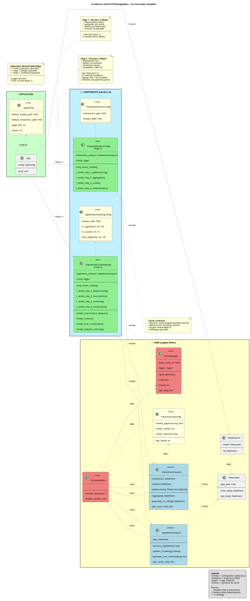
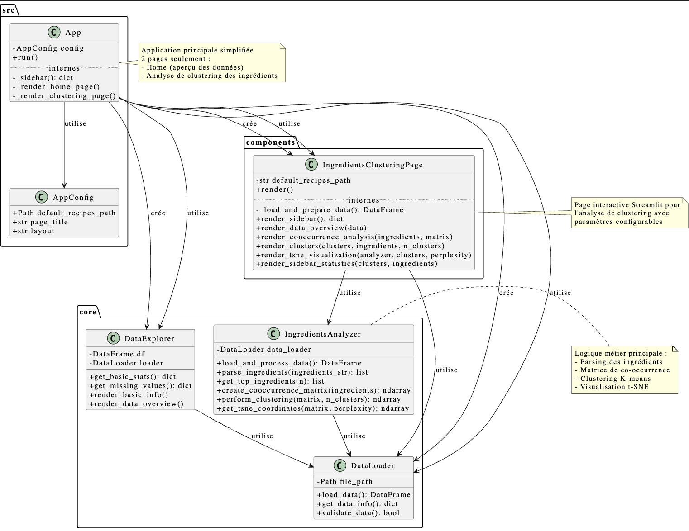

# IADATA700_mangetamain


Dans le cadre d'un enseignement à Telecom Paris, ce projet consiste en une application web interactive d'analyse de données pour une entreprise fictive : **Mangetamain** ; leader dans la recommandation B2C de recettes de cuisine à l'ancienne bio.

## 🚀 Application Streamlit

### 📋 Pages disponibles
1. **🏠 Home** - Exploration générale des données (recettes ou interactions)
2. **🍳 Analyse de clustering des ingrédients** - Clustering basé sur la co-occurrence
3. **🔥 Analyse popularité des recettes** - Popularité (nombre d'interactions) vs note moyenne & caractéristiques (minutes, n_steps, n_ingredients)

### 🛠️ Lancement
```bash
uv sync
uv run streamlit run src/app.py
```

### 📂 Structure du projet
```
src/
├── app.py                          # Application principale Streamlit
├── core/                          # Modules de base
│   ├── data_loader.py            # Chargement des données
│   ├── data_explorer.py          # Exploration de base (accès aux données)
│   ├── interactions_analyzer.py  # Agrégations popularité / notes / features
│   └── ingredients_analyzer.py   # Analyse des ingrédients
├── components/                   # Composants de l'application
│   ├── ingredients_clustering_page.py     # Page clustering des ingrédients
│   └── popularity_analysis_page.py         # Page analyse popularité
└── utils/                        # Utilitaires (vide actuellement)
```

### 📊 Données requises
Chemins par défaut :
- **Recettes** : `data/RAW_recipes.csv`
- **Interactions** : `data/RAW_interactions.csv`

> 💡 **Prérequis** : Le fichier de données doit être présent localement dans le dossier `data/` à la racine du projet.

### ✨ Fonctionnalités
- **Page Home** : Exploration générale des données + métriques
- **Clustering Ingrédients** :
  - Sélection du nombre d'ingrédients à analyser
  - Regroupement normalisé + co-occurrences
  - Clustering K-means + t-SNE
  - Analyse de groupes & debug mappings
- **Popularité Recettes** :
  - Agrégat par recette : interaction_count, avg_rating, minutes, n_steps, n_ingredients
  - Scatter Note moyenne vs Popularité
  - Scatter Caractéristiques vs Popularité (taille = note)
  - Aperçu DataFrame fusionné (diagnostic)
  - Filtre sur interactions minimales
  - Prétraitement IQR configurable (exclut les notes pour préserver la distribution réelle)
  - Segmentation par percentiles (Low ≤ P25, Medium ≤ P75, High ≤ P95, Viral > P95)

### 🔧 Prétraitement & Segmentation

**IQR (InterQuartile Range) Filtering**
- Variables filtrées: `minutes`, `n_steps`, `n_ingredients`
- Formule: Q1 − k·IQR ≤ valeur ≤ Q3 + k·IQR (k réglable 1.0 → 20.0)
- `rating` n'est pas filtré pour conserver les avis extrêmes.

**Segmentation Popularité**
- Low: interaction_count ≤ P25
- Medium: P25 < interaction_count ≤ P75
- High: P75 < interaction_count ≤ P95
- Viral: interaction_count > P95

Cette segmentation reflète la distribution longue traîne et met en évidence l'extrême rareté des recettes virales.

## 📐 Architecture UML

### 🖼️ Visualisation directe



<details>
<summary><b>Aperçu (image PNG)</b></summary>



> ⚠️ **Si l'image ne s'affiche pas** : Générez-la avec `plantuml docs/class-diagram.puml`

</details>

**Générer le diagramme :**
```bash
# Installation PlantUML (macOS)
brew install plantuml

# Génération PNG haute résolution (200 DPI)
plantuml docs/class-diagram.puml

# Ou SVG pour zoom sans perte
plantuml -tsvg docs/class-diagram.puml
```


## 🧪 Tests & Qualité

### Exécuter les tests
```bash
# Tous les tests
uv run pytest

# Tests avec couverture
uv run pytest --cov=src --cov-report=html

# Tests spécifiques
uv run pytest tests/test_ingredients_clustering_page.py

# Mode verbose
uv run pytest -v
```

### Logger
Le projet utilise un système de logging structuré dans `debug/` :
- **`debug/debug.log`** : Logs INFO/DEBUG détaillés
- **`debug/errors.log`** : Erreurs uniquement

Configuration dans `src/core/logger.py` :
```python
from src.core.logger import get_logger
logger = get_logger(__name__)
logger.info("Message d'information")
```

### Cache
Système de cache automatique pour optimiser les analyses lourdes :
- **Localisation** : `cache/analyzer/operation/hash.pkl`
- **Contrôle** : Sidebar de chaque page (activation/nettoyage)
- **Détection** : Changements de paramètres automatiques

